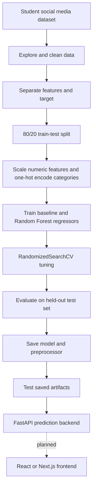
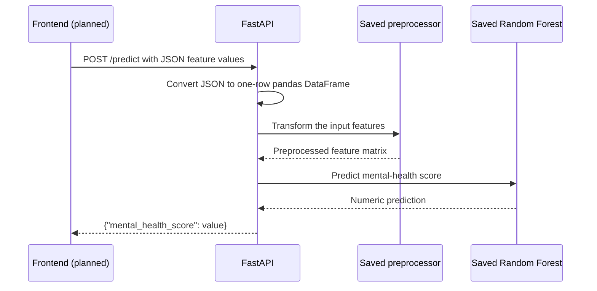

# Student Social Media and Mental Health Score

A machine-learning project that explores student social-media habits and predicts a numeric mental-health score from demographic, academic, and lifestyle information. The repository contains the exploratory/modeling notebook, the source CSV, saved scikit-learn artifacts, and a FastAPI prediction service.

> This is an educational machine-learning project. Its predictions are estimates from a dataset and are not a clinical assessment, diagnosis, or substitute for professional care.

## Project Status

- **Data exploration and model training:** implemented in `notebooks/01_eda.ipynb`.
- **Prediction API:** implemented in `app/main.py` with `GET /` and `POST /predict`.
- **Saved model artifacts:** `mental_health_model.pkl` and `preprocessor.pkl` are present in the project root.
- **Frontend:** not implemented yet. A React or Next.js client is the next planned layer and can call the API's `/predict` endpoint.

## End-to-End Workflow

The notebook loads and cleans the dataset, explores it, trains and compares regression models, tunes a Random Forest, evaluates it on a held-out test set, saves the model/preprocessor, and tests a prediction using the saved artifacts. The API then serves predictions from those saved files.



### Notebook workflow details

1. Load `data/Student Social Media And Mental Health Impact.csv` with pandas.
2. Inspect the shape, columns, summary statistics, missing values, duplicates, category frequencies, and numeric correlations.
3. Remove duplicate rows and rows with negative `Physical_Activity_Hours`. The notebook records 5,000 original rows and 4,988 rows after cleaning; no missing values are reported in its initial null check.
4. Use the 12 remaining columns as predictors (`X`) and `Mental_Health_Score` as the regression target (`y`).
5. Split data into training and test partitions with `test_size=0.2` and `random_state=42`.
6. Apply `StandardScaler` to numeric columns and `OneHotEncoder(handle_unknown="ignore")` to categorical columns through a `ColumnTransformer`.
7. Fit a `LinearRegression` baseline and a `RandomForestRegressor`, inspect the top 20 feature importances, plot the top 15 as a horizontal bar chart, and run five-fold cross-validation.
8. Tune the Random Forest with `RandomizedSearchCV` (20 sampled configurations, five-fold CV, R² scoring). The search covers `n_estimators`, `max_depth`, `min_samples_split`, `min_samples_leaf`, and `max_features`.
9. Evaluate the selected model on the held-out test partition and save the fitted model and preprocessing transformer with Joblib.
10. Load both saved artifacts and run a sample prediction, mirroring how the API uses them.

The notebook's recorded tuned-model results are:

| Metric               | Held-out test result |
| -------------------- | -------------------: |
| MAE                  |               0.2693 |
| MSE                  |               0.1383 |
| RMSE                 |               0.3719 |
| R²                   |               0.9188 |
| Best five-fold CV R² |               0.9018 |

These are the outputs stored in the notebook and may change if the data, environment, or training process changes.

**Evaluation note:** the notebook fits the preprocessor on the full training partition before running cross-validation and hyperparameter search. As a result, cross-validation folds share preprocessing statistics, which can make CV scores optimistic. Fitting preprocessing inside a scikit-learn `Pipeline` during each fold would avoid that leakage. The held-out test set remains separate from model fitting.

## Dataset and Features

The CSV contains 5,000 rows and 13 columns: 12 input features and the numeric target `Mental_Health_Score`.

| Feature                   | Meaning / type                                |
| ------------------------- | --------------------------------------------- |
| `Age`                     | Age; numeric                                  |
| `Gender`                  | Gender category                               |
| `Country`                 | Country category                              |
| `Academic_Level`          | Student academic level category               |
| `Most_Used_Platform`      | Most-used social platform category            |
| `Purpose_Of_Use`          | Main purpose for using social media category  |
| `Avg_Daily_Usage_Hours`   | Average daily social-media use; numeric hours |
| `Daily_Unlocks`           | Daily device unlock count; numeric            |
| `Study_Hours`             | Study time; numeric hours                     |
| `Physical_Activity_Hours` | Physical activity; numeric hours              |
| `Sleep_Hours_Per_Night`   | Sleep duration; numeric hours                 |
| `Stress_Level`            | Stress category                               |
| `Mental_Health_Score`     | Prediction target; numeric score              |

The notebook defines the first six listed non-target fields as categorical (`Gender`, `Country`, `Academic_Level`, `Most_Used_Platform`, `Purpose_Of_Use`, and `Stress_Level`) and the other six as numeric.

## Prediction Request Lifecycle

The frontend flow below describes the planned client integration. The FastAPI backend portion is implemented now.



## Run Locally

Run commands from the repository root. The API currently loads the model files using paths relative to the process working directory, so starting it from the root is required.

```bash
python -m venv .venv
source .venv/bin/activate
python -m pip install -r requirement.txt
uvicorn app.main:app --reload
```

The API is available at:

- `GET http://127.0.0.1:8000/` — confirms the service is running.
- `POST http://127.0.0.1:8000/predict` — returns a predicted mental-health score.
- `http://127.0.0.1:8000/docs` — interactive Swagger UI.

## Call the Prediction Endpoint

Send all 12 predictor fields as a JSON object. Do not include `Mental_Health_Score`; that is the value being predicted.

```bash
curl -X POST "http://127.0.0.1:8000/predict" \
  -H "Content-Type: application/json" \
  -d '{
    "Age": 21,
    "Gender": "Male",
    "Country": "India",
    "Academic_Level": "Undergraduate",
    "Most_Used_Platform": "YouTube",
    "Purpose_Of_Use": "Education",
    "Avg_Daily_Usage_Hours": 5.5,
    "Daily_Unlocks": 180,
    "Study_Hours": 3.0,
    "Physical_Activity_Hours": 2.0,
    "Sleep_Hours_Per_Night": 7.0,
    "Stress_Level": "Medium"
  }'
```

Example response:

```json
{
  "mental_health_score": 7.12
}
```

The value above is illustrative; the actual result depends on the loaded model and request data. The current endpoint accepts a generic JSON dictionary and does not define field-level Pydantic validation or domain-specific range checks.

## Project Structure

```text
.
├── app/
│   ├── main.py          # FastAPI app and prediction endpoint
│   └── schema.py        # Reserved for request/response schemas; currently empty
├── data/
│   └── Student Social Media And Mental Health Impact.csv
├── notebooks/
│   └── 01_eda.ipynb     # EDA, preprocessing, model training, evaluation, and artifact test
├── mental_health_model.pkl
├── preprocessor.pkl
├── requirement.txt
└── README.md
```

## Model Artifacts

- `mental_health_model.pkl` contains the tuned `RandomForestRegressor` used by the API.
- `preprocessor.pkl` contains the fitted `ColumnTransformer` used during training.

Both files must be available at the project root when starting the service. The preprocessor and model must come from the same training run so feature encoding remains compatible. Pickle/joblib files should only be loaded from trusted sources.

## Re-running the Notebook

Install the project dependencies, open `notebooks/01_eda.ipynb` in Jupyter or VS Code, and run the cells in order. The notebook reads the CSV by a path relative to the notebook directory. Its artifact-saving cells write the model files to the notebook's current working directory; move or save them in the project root for the API to load them as currently implemented.

## Current Scope and Next Step

The backend accepts one observation per request and responds with one numeric prediction. The next planned step is a React or Next.js form that gathers the 12 input values, sends them to `POST /predict`, and displays the returned score. The API currently has no authentication, persistence, batch-prediction route, or input-range validation.
